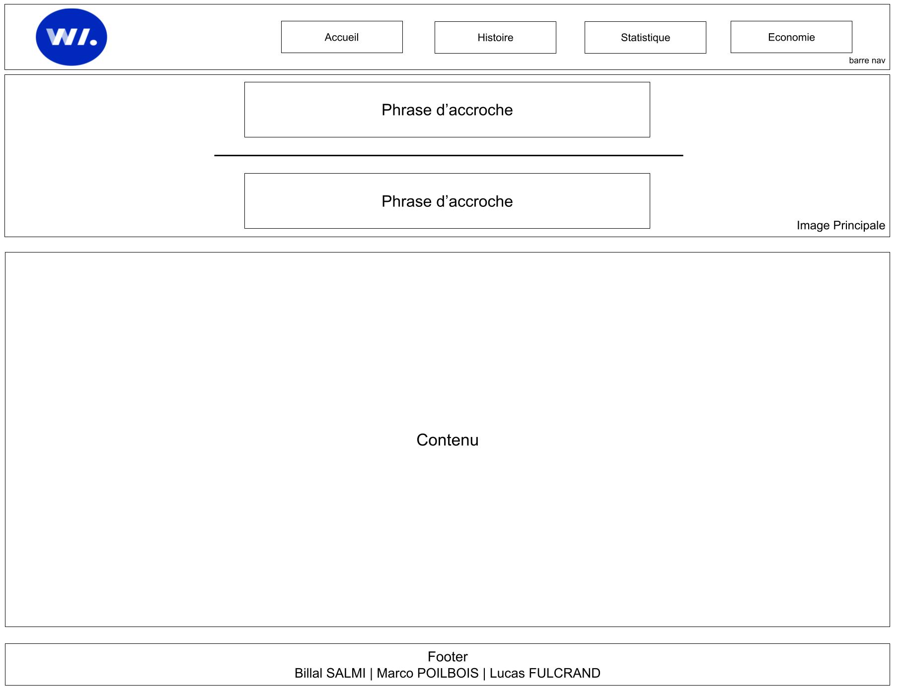
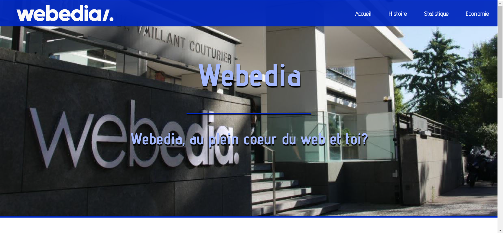
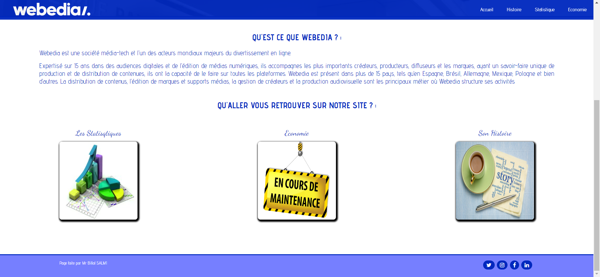

# Diawebe

Ce projet avait pour but de concevoir un site Web présentant notre entrerprise. Nous avons choisis Webedia renommé "Diawebe" pour faire savoir que vous vous retrouverez sur notre site.
Vous allez retrouver sur ce Readme, la composition de notre groupe, l'auteur de chaque page présent sur le site, les liens menant au dossier "doc", les autres tâches réalisé pour ce projet ainsi que les images montrant l'écran prototype et le zoning.

### Composition du groupe :

[FULCRAND Lucas](mailto:lucas.fulcrand@edu.univ-fcomte.fr?subject=SAE_1_05_06) (Référent) - SALMI Billal - POILBOIS Marco

## Auteur des pages

FULCRAND Lucas -> Page histoire  
SALMI Billal -> [Page d'accueil](https://lfulcran-iut90.github.io/Webedia/Le_Site_SAE.05-06/Page_Accueil/page_a.html) et page de l'économie  
POILBOIS Marco -> Page des statistiques

## Autres tâches

FULCRAND Lucas -> Création du contenu du Readme  
SALMI Billal -> Création de l'écran de zoning et de l'écran prototype  
POILBOIS Marco -> Réponse aux questionnaires + l'envoie des deux

## Dossier "doc"
[Ecran prototype (haut)](doc/Ecran_prototype_haut.jpg) 
[Ecran prototype (bas)](doc/Ecran_prototype_bas.jpg) 
[Rapport économique](doc/Grp12_FULCRAND_Rapport_economique.pdf) 
[Le pdf montrant les tests de validité des sites](doc/Validation.pdf)

## Ecran de zoning

Nous avons eu carte blanche pour le zoning, grâce aux réponses du questionnaire. Le zoning ci-dessous est le même pour chaque page du groupe, nous le trouvons assez propre et érgonomique car nous remarquons bien les différentes parties de la page (Barre de navigation, le contenu, etc)

## Ecran prototype 

Nous avons choisis ce design pour rester dans le thème de Webedia. En effet, la couleur de la barre de navigation est la même que celle du site officiel de Webedia. Le site de Webedia étant un site dynamique, nous avons pensés à rendre également notre site dynamique.

